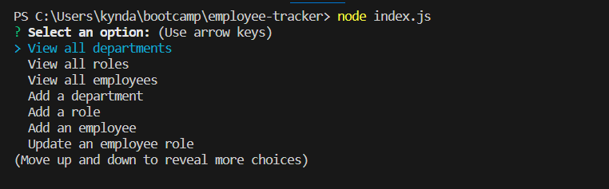

# Employee Tracker

## Description

AS A business owner
I WANT to be able to view and manage the departments, roles, and employees in my company
SO THAT I can organize and plan my business

## Installation

In the integrated terminal, the application will be invoked by using the following command: 'node index.js'

## Mock Up

## Credits

Class recordings from UC Berkeley/edX Zoom classes
[MySql.com](https://dev.mysql.com/) for commands and troubleshooting

## Links

[Github Repository](https://github.com/kyndalbowers/employee-tracker) 
[Video Walkthrough](https://drive.google.com/file/d/1tujHGfCHDI8yGGBm6BifKSrJwDU2hQoL/view)
